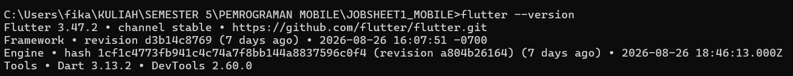
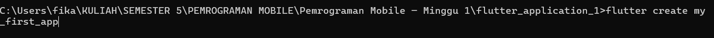
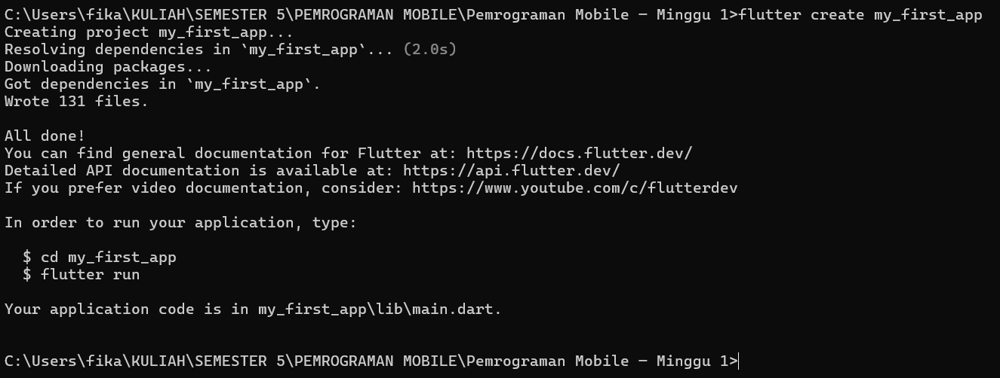
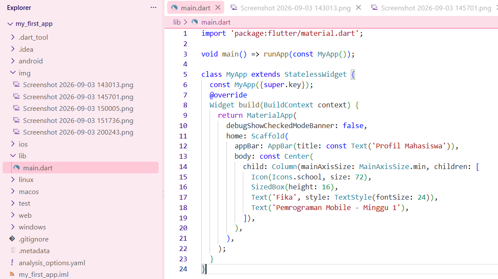
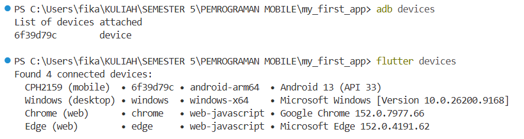
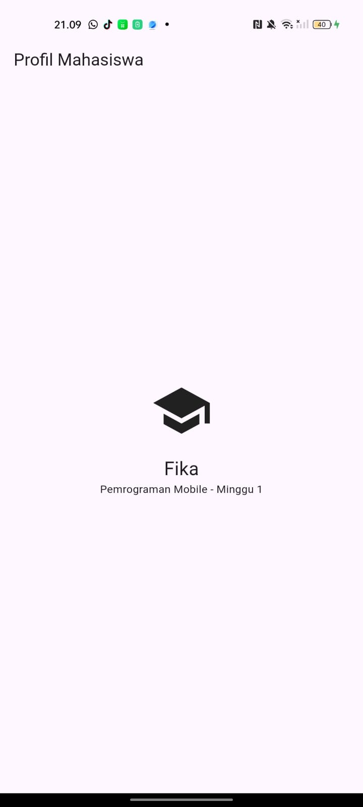
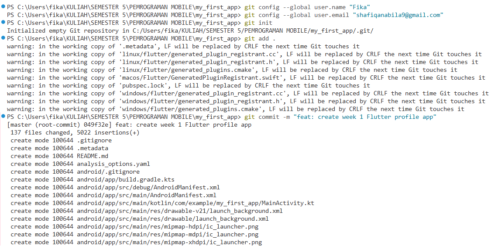
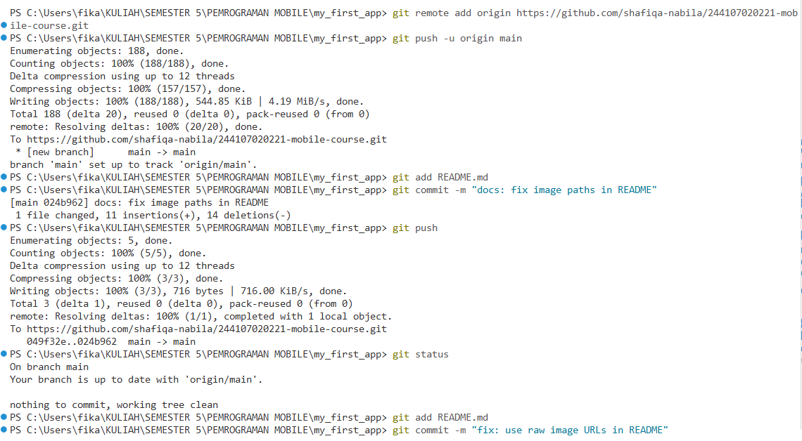

## Jobsheet 1
*Nama:* Shafiqa Nabila Maharani Khoirunnisa
*NIM:* 244107020221
*Kelas:* TI-3E

## Langkah-langkah beserta bukti Screenshoot:
### LAPORAN PRAKTIKUM WEEK01

<h3>JOBSHEET 1</h3>

<blockquote>

### Langkah Praktikum :
Membuat dan menjalankan proyek

Buka terminal pada folder kerja, lalu jalankan:

### Mengubah UI default

Hasil:

### Git dan portfolio

</blockquote>

