## Jobsheet 2
*Nama:* Shafiqa Nabila Maharani Khoirunnisa 
*NIM:* 244107020221 
*Kelas:* TI-3E 

## Langkah-langkah beserta bukti Screenshoot:
### LAPORAN PRAKTIKUM WEEK02

<h3>JOBSHEET 2</h3>

<blockquote>

### Langkah Praktikum :
## Praktikum: layout sederhana (warm-up) 
Sebelum dashboard responsif, latih dulu widget dasar dengan membuat kartu profil sederhana. Buat project baru atau ganti sementara isi lib/main.dart:

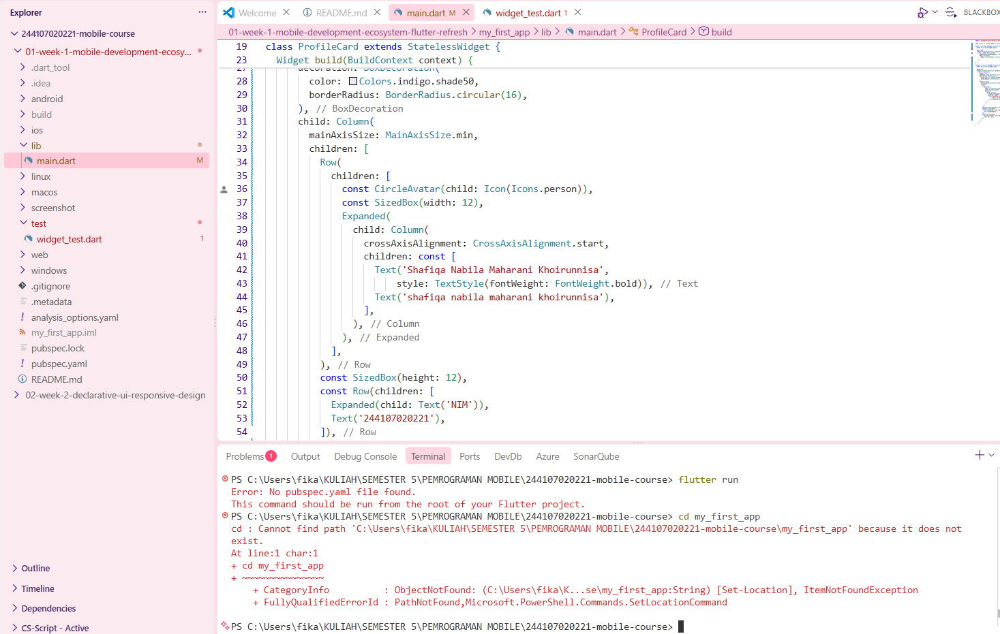
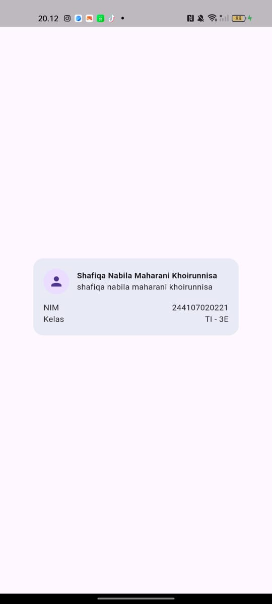

## Praktikum: dashboard responsif
# Menyiapkan project

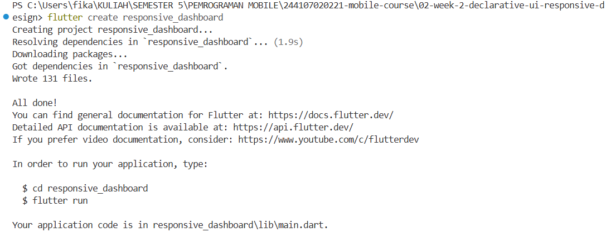
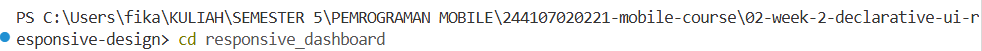
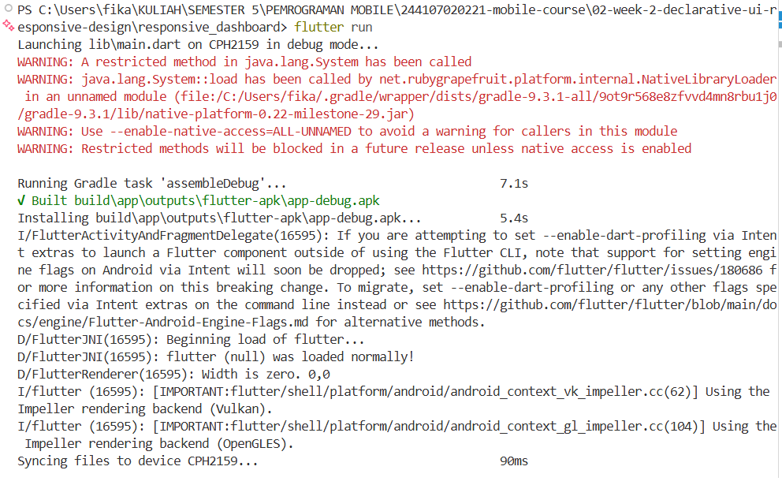
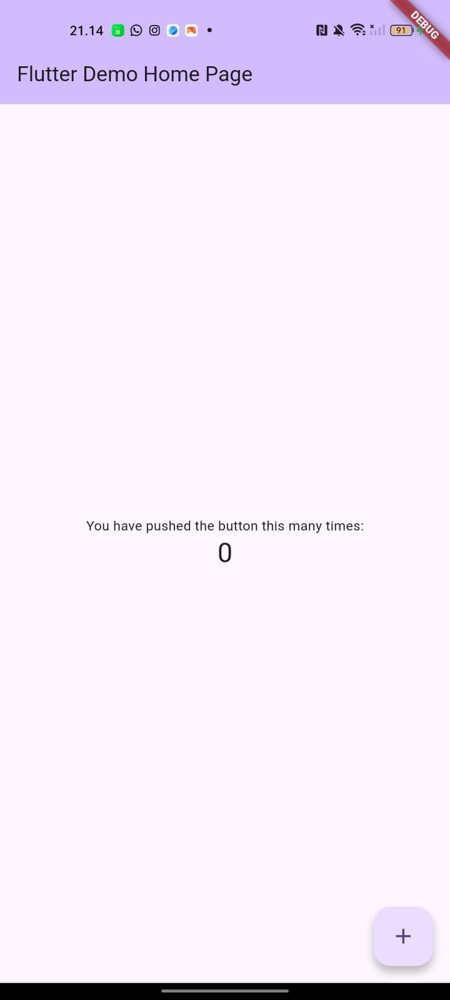
 
Buka lib/main.dart. Buat aplikasi profil sederhana berikut, lalu jalankan pada emulator atau perangkat fisik. 
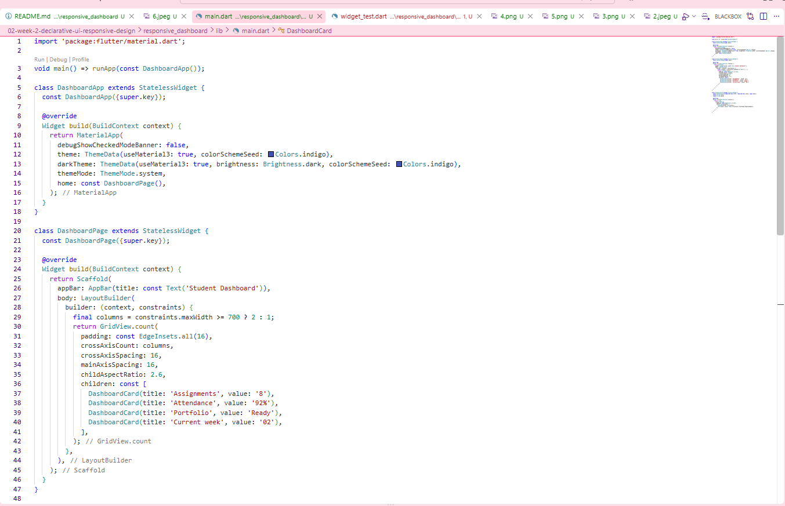
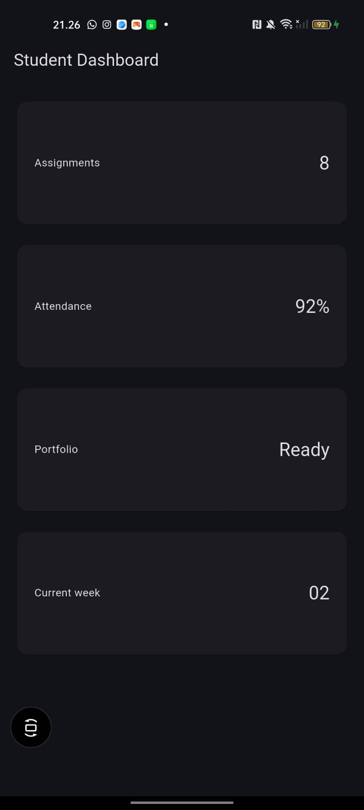
 

# Menambahkan interaksi: StatefulWidget dan Cupertino  
Sejauh ini dashboard masih StatelessWidget. Ubah DashboardApp menjadi StatefulWidget dan tambahkan CupertinoSwitch (widget Cupertino) pada AppBar untuk mengganti tema secara manual — sekaligus membedakan komponen Material dan Cupertino secara langsung: 
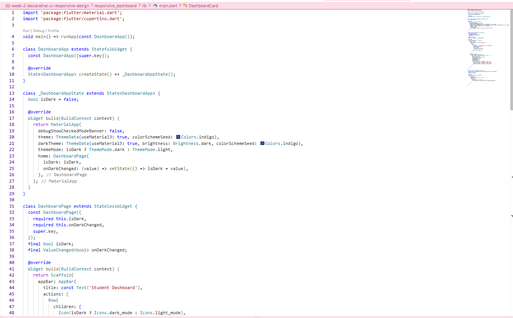
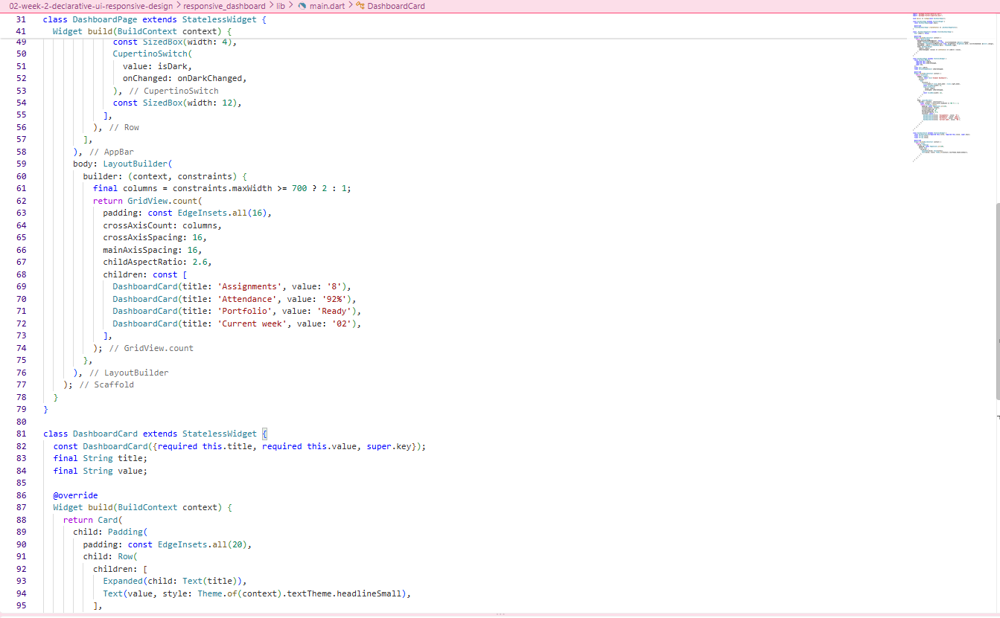
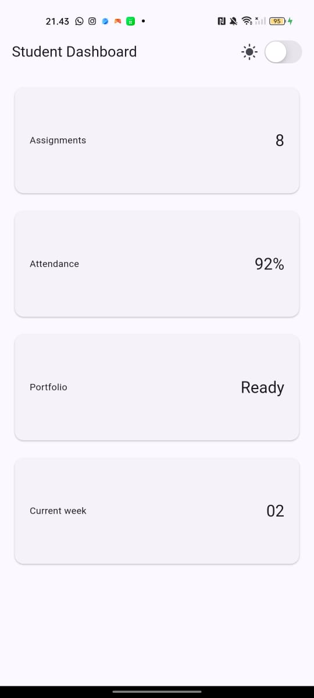
 

# Eksperimen layout
1. Ubah breakpoint dari 700 menjadi nilai lain dan amati perubahan jumlah kolom. 
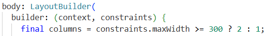
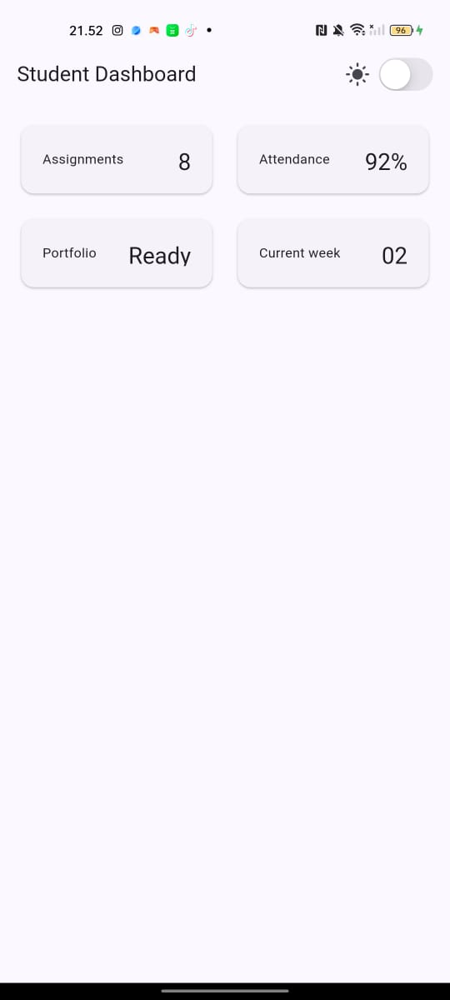
 
2. Ubah themeMode menjadi ThemeMode.dark, lalu kembalikan ke ThemeMode.system. 
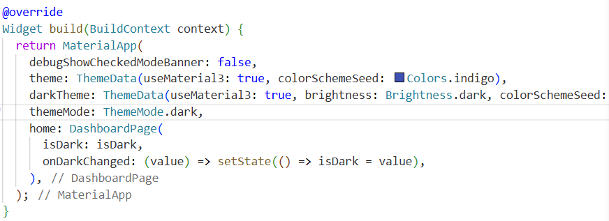
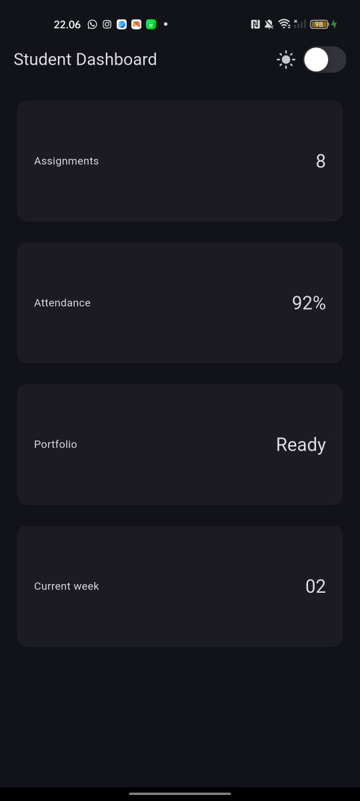
 
3. Uji aplikasi dengan ukuran layar emulator yang berbeda. 

 
4. Tambahkan Semantics atau label yang bermakna pada elemen yang penting bagi screen reader. 
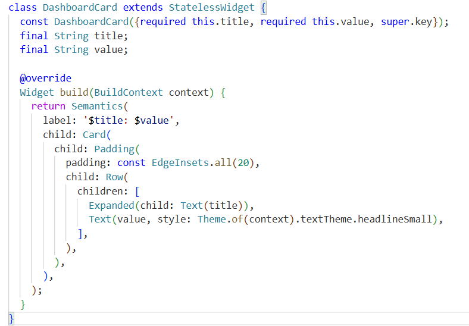
Secara visual tidak ada perubahan pada tampilan, namun setelah mangaktifkan talkback, ketika saya menyentuh maka akan tebacakan dengan suara. 

## AI Prompt Challenge
# Setelah implementasi mandiri selesai, gunakan AI hanya untuk membandingkan dua alternatif tata letak. Kerjakan challenge berikut:
1. Prompt desain. Ajukan prompt ini (atau variasinya): "Bandingkan dua tata letak dashboard akademik untuk Flutter: versi GridView dan versi LayoutBuilder + Column. Jelaskan trade-off responsif dan aksesibilitasnya."
 
Jawaban dari AI : 
Kedua pendekatan ini punya kelebihan dan kekurangan:
1. GridView
Kelebihan: Sangat mudah membuat grid yang rapi dan responsif dengan crossAxisCount. Cocok untuk konten homogen (kartu-kartu dengan ukuran sama). 
Kekurangan: Kurang fleksibel untuk layout campuran (header + grid). GridView akan mengambil seluruh ruang layar. 
Aksesibilitas: Mendukung scrolling yang baik dan menangani fokus untuk screen reader. 
2. LayoutBuilder + Column 
Kelebihan: Sangat fleksibel. Bisa menyusun header (profil) di atas menggunakan Container + Row, lalu grid di bawah menggunakan Expanded. Ini saya gunakan di tugas ini. 
Kekurangan: Kode lebih panjang dan butuh manajemen layout yang hati-hati. 
Aksesibilitas: Sama baiknya, asalkan ditambah Semantics pada elemen penting. 
Keputusan yang Dipilih:  
Saya memilih LayoutBuilder + Column karena tugas ini membutuhkan header profil di atas grid. 
Alasan Teknis: 
- Header profil butuh tata letak Row dan Column yang kompleks.  
- Expanded memastikan grid mengisi sisa ruang layar tanpa overflow.  
 

2. Prompt penguatan konsep. "Jelaskan kapan penggunaan Expanded justru menyebabkan overflow di dalam Row, beri contoh kode yang gagal dan perbaikannya." 

Jawaban dari AI:  
Expanded di dalam Row atau Column akan menyebabkan overflow jika digunakan di dalam parent widget yang tidak memiliki batasan ukuran (unbounded constraints). Ini sering terjadi ketika Row atau Column berada di dalam SingleChildScrollView tanpa batasan lebar, atau di dalam Container tanpa tinggi/lebar yang ditentukan. 
SingleChildScrollView(
  child: ConstrainedBox(
    constraints: BoxConstraints(maxWidth: MediaQuery.of(context).size.width),
    child: Row(
      children: [
        Expanded(child: Text('Teks yang sangat panjang sekali untuk diuji coba overflow')),
        Text('Teks B'),
      ],
    ),
  ),
)
 
Penyebab error: SingleChildScrollView tidak memberikan batasan lebar pada Row, sehingga Expanded tidak tahu harus membagi ruang sebesar apa, dan terjadilah overflow. 
Perbaikan (Solusi 1 - Menggunakan ConstrainedBox): 
SingleChildScrollView(
  child: Row(
    children: [
      Flexible(
        child: Text('Teks yang sangat panjang sekali untuk diuji coba overflow'),
      ),
      Text('Teks B'),
    ],
  ),
) 
Perbaikan (Solusi 2 - Menggunakan Flexible): 
SingleChildScrollView(
  child: Row(
    children: [
      Flexible(
        child: Text('Teks yang sangat panjang sekali untuk diuji coba overflow'),
      ),
      Text('Teks B'),
    ],
  ),
) 
Penjelasan: Expanded dan Flexible membutuhkan batasan ukuran dari parent. Dengan membungkus Row dengan ConstrainedBox atau menggunakan Flexible, kita memberikan batasan tersebut dan mencegah overflow. 
 
Keputusan Saya:
Dari dua solusi di atas, saya lebih sering menggunakan pendekatan ConstrainedBox karena lebih eksplisit dalam memberikan batasan ukuran, terutama jika parent-nya adalah SingleChildScrollView. Namun, Flexible juga merupakan pilihan yang baik jika kita hanya ingin memberikan ruang fleksibel pada satu child saja. 
 

3. Verification prompt. Minta AI mengaudit hasilnya sendiri: "Periksa kembali rekomendasi layout di atas: apakah tetap responsif di bawah 600px, apakah mengurangi aksesibilitas, dan apakah ada widget yang tidak tersedia di Flutter stabil saat ini?" 

Jawaban dari AI:  

Responsif di bawah 600px? ✅ Ya. Dengan menggunakan LayoutBuilder dan breakpoint const kWideBreakpoint = 700;, layout akan berubah menjadi 1 kolom pada layar dengan lebar kurang dari 700px (termasuk di bawah 600px). Ini memastikan tampilan tetap rapi di semua ukuran HP. 

Apakah mengurangi aksesibilitas? ❌ Tidak. Aksesibilitas justru ditingkatkan dengan penambahan Semantics(label: '$title: $value') pada setiap kartu. Hal ini memungkinkan screen reader (seperti TalkBack) untuk membacakan informasi yang ada di setiap kartu. 

Widget yang tidak tersedia di Flutter stabil? ❌ Tidak. Semua widget yang digunakan (MaterialApp, Scaffold, AppBar, CupertinoSwitch, LayoutBuilder, GridView, Card, Row, Column, Container, Expanded, Semantics) adalah widget inti (core widgets) yang sudah stabil dan tersedia di Flutter versi stable. 

Kesimpulan Verifikasi: 
Layout yang direkomendasikan tetap responsif, tidak mengurangi, bahkan meningkatkan aksesibilitas, dan menggunakan widget yang stabil. Layout ini siap digunakan untuk tugas produksi. 

Keputusan Saya: 
Berdasarkan verifikasi AI, layout yang saya gunakan (LayoutBuilder + Column) sudah memenuhi semua kriteria: responsif, aksesibel, dan menggunakan widget stabil. Saya memutuskan untuk tetap menggunakan layout ini. 
 

## Refactoring challenge
Setelah tugas utama berjalan, rapikan kode Anda: 

1. Ekstrak kartu informasi menjadi widget reusable (misal InfoCard) yang menerima title dan value, sehingga tidak ada duplikasi widget. 
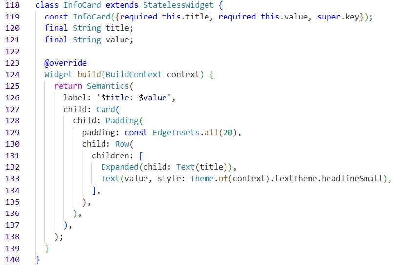

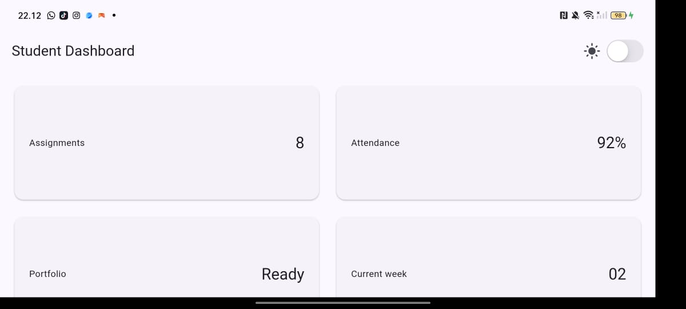
 
2. Ganti warna dan ukuran yang di-hardcode dengan Theme.of(context) agar mengikuti tema terang/gelap secara otomatis. 
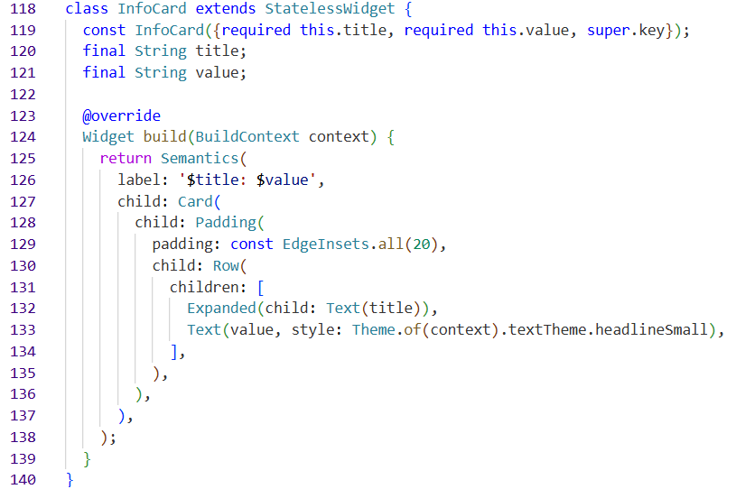
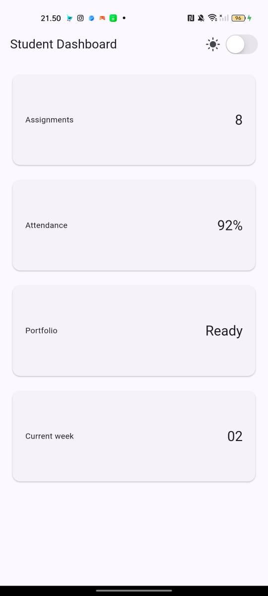
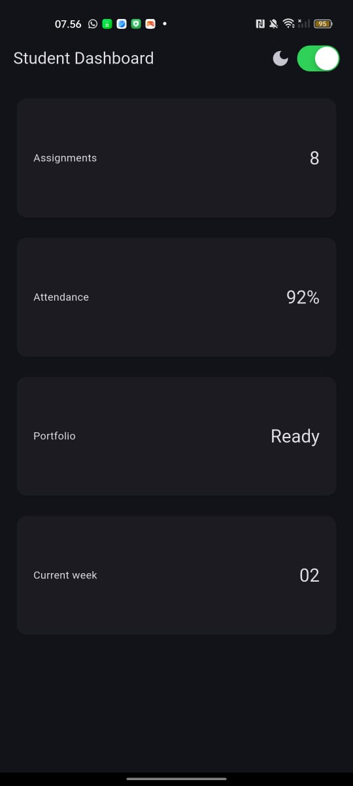
 
3. Pindahkan breakpoint ke satu konstanta bernama (misal const kWideBreakpoint = 700;) agar hanya didefinisikan satu kali. 
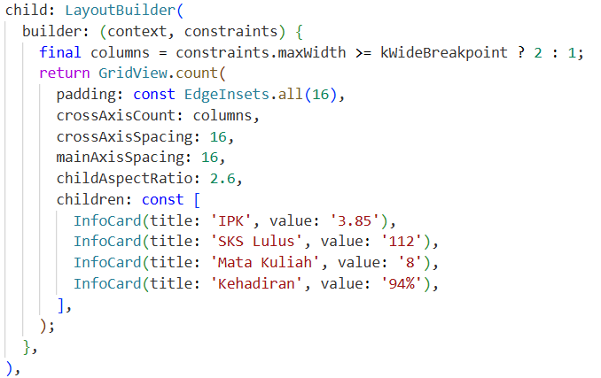
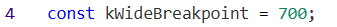
 
4. Jalankan flutter analyze dan pastikan tidak ada error maupun warning baru. 
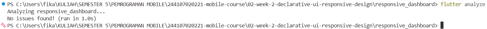

## Testing dasar
Tambahkan widget test di folder test/ untuk memverifikasi perilaku responsif. Override ukuran layar menggunakan tester.view: 
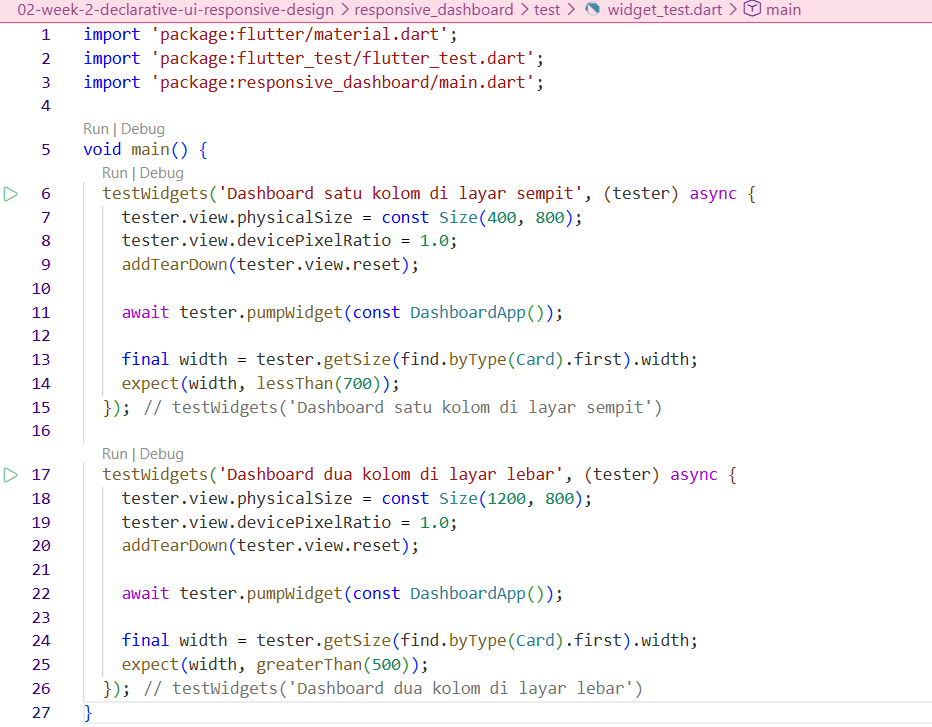
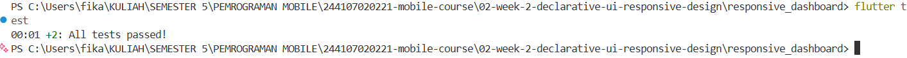

## Refleksi
- Apa perbedaan cara berpikir imperative dan declarative saat membangun UI? 
Cara berpikir imperative berfokus pada "bagaimana" membuat UI, yaitu dengan memberikan instruksi langkah demi langkah secara manual, seperti "cari widget ini, ubah warnanya, lalu perbarui tampilan". Sedangkan cara berpikir declarative berfokus pada "apa" yang ingin ditampilkan, yaitu dengan mendeskripsikan tampilan akhir secara langsung, misalnya "tampilkan teks berwarna merah jika terjadi error". Di Flutter, kita menggunakan pendekatan declarative, di mana kita cukup menuliskan widget yang diinginkan dan Flutter akan mengurus proses rendering-nya secara otomatis. Dengan pendekatan ini, kode menjadi lebih mudah dibaca, diprediksi, dan dipelihara karena kita tidak perlu mengatur perubahan UI secara manual satu per satu. 
- Kapan Expanded membantu dan kapan penggunaannya justru menghasilkan layout error? 
Expanded membantu ketika kita ingin membagi ruang secara proporsional di dalam Row atau Column, misalnya dua Expanded di dalam Row akan membuat masing-masing child mendapatkan lebar 50%. Namun, Expanded justru menyebabkan error (overflow) ketika digunakan di dalam parent yang tidak memiliki batasan ukuran (unbounded constraints), seperti Expanded di dalam Row yang berada di dalam SingleChildScrollView tanpa ConstrainedBox atau batasan lebar. Error yang muncul biasanya berupa RenderFlex children have non-zero flex but incoming width constraints are unbounded. Solusinya adalah dengan membungkus Row menggunakan ConstrainedBox atau mengganti Expanded dengan Flexible yang lebih fleksibel terhadap batasan ukuran. 
- Bagaimana breakpoint dan theme memengaruhi pengalaman pengguna? 
Breakpoint memengaruhi pengalaman pengguna dengan menentukan jumlah kolom yang ditampilkan pada layar; di layar sempit (di bawah 700px) hanya ditampilkan satu kolom, sedangkan di layar lebar (di atas 700px) ditampilkan dua kolom, sehingga tampilan menjadi responsif dan tidak ada teks yang terpotong. Sementara itu, theme (light/dark) memengaruhi kenyamanan visual pengguna; light mode cocok digunakan di siang hari karena latar terang dan teks gelap, sedangkan dark mode cocok digunakan di malam hari karena mengurangi kelelahan mata dan hemat baterai pada layar OLED. Dengan adanya toggle tema, pengguna diberikan kontrol untuk memilih tampilan sesuai preferensi dan kondisi lingkungan. Selain itu, penggunaan Theme.of(context) memastikan warna dan ukuran teks otomatis menyesuaikan diri saat tema berubah, sehingga teks tetap terbaca dengan kontras yang baik di kedua mode. Secara keseluruhan, breakpoint dan theme membuat aplikasi lebih inklusif, nyaman, dan mudah digunakan di berbagai kondisi. 
- Apa yang Anda verifikasi dari rekomendasi AI setelah tugas inti selesai? 
Setelah tugas inti selesai, saya memverifikasi rekomendasi AI dengan beberapa cara. Pertama, saya menguji responsivitas dengan menjalankan aplikasi di HP fisik pada posisi portrait (lebar sekitar 360px) dan landscape (lebar sekitar 800px), dan memastikan layout tetap rapi tanpa overflow. Kedua, saya memverifikasi aksesibilitas dengan mengaktifkan TalkBack di HP dan memastikan Semantics pada InfoCard terbaca dengan benar. Ketiga, saya memastikan semua widget yang digunakan (CupertinoSwitch, LayoutBuilder, GridView, Semantics, dll) tersedia di Flutter versi stable yang saya pakai. Keempat, saya menjalankan flutter analyze dan flutter test untuk memastikan kode bersih dan kedua test responsif lulus. Terakhir, saya membandingkan dua pendekatan layout (GridView vs LayoutBuilder + Column) dan memilih LayoutBuilder + Column karena lebih fleksibel untuk menggabungkan header profil dengan grid kartu. Dengan verifikasi ini, saya tidak hanya menyalin rekomendasi AI, tetapi benar-benar menguji dan memastikan bahwa saran tersebut berjalan sesuai kebutuhan tugas. 
</blockquote>

