## Jobsheet 3
*Nama:* Shafiqa Nabila Maharani Khoirunnisa
*NIM:* 244107020221
*Kelas:* TI-3E

## Langkah-langkah beserta bukti Screenshoot:
### LAPORAN PRAKTIKUM WEEK03

<h3>JOBSHEET 3</h3>

<blockquote>

### Langkah Praktikum :

# Praktikum 1 — Aplikasi multi-page dengan GoRouter
Buat project baru:
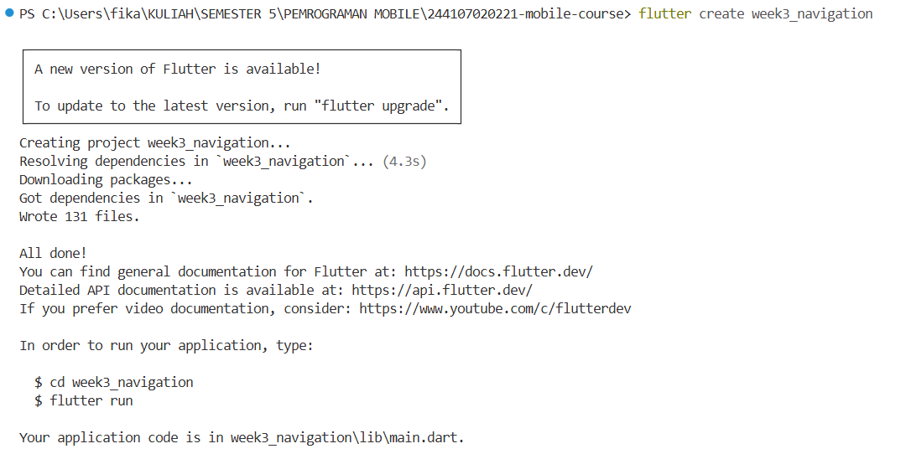
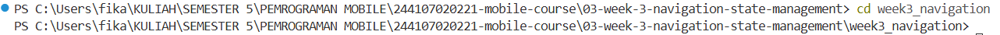
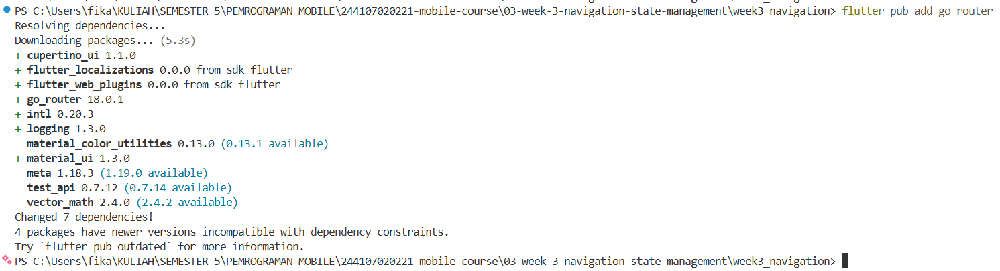

Susun struktur folder:
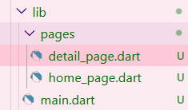

1. Definisikan router di lib/main.dart:
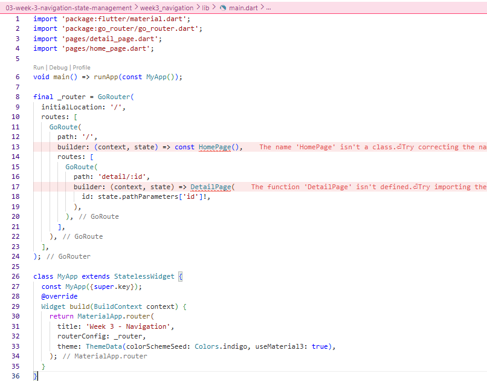

2. Halaman Home (lib/pages/home_page.dart):
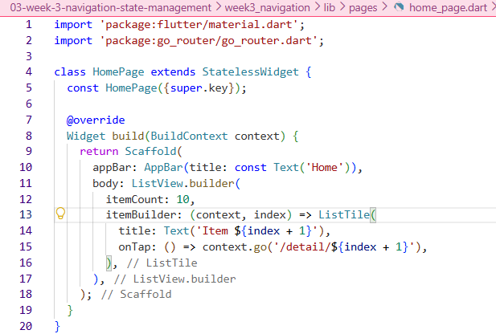

3. Halaman Detail (lib/pages/detail_page.dart):
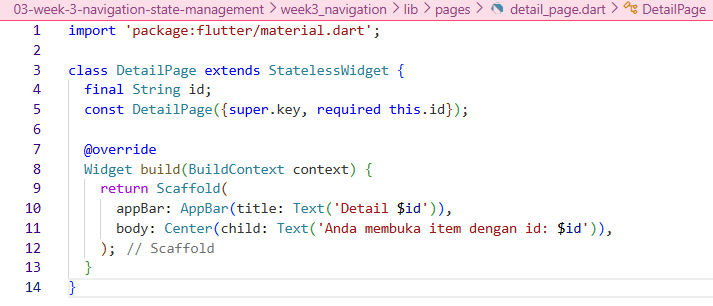

4. Jalankan dan amati. Buka item, lalu tekan tombol back sistem. Perhatikan bahwa path berubah mengikuti layar aktif, path yang sama juga dapat diakses langsung tanpa melewati Home. Inilah keunggulan router deklaratif dibanding Navigator 1.0.
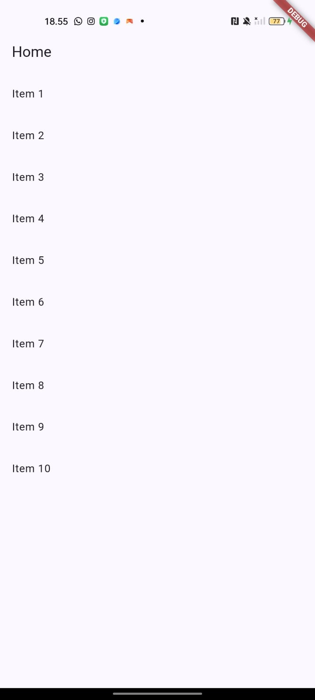
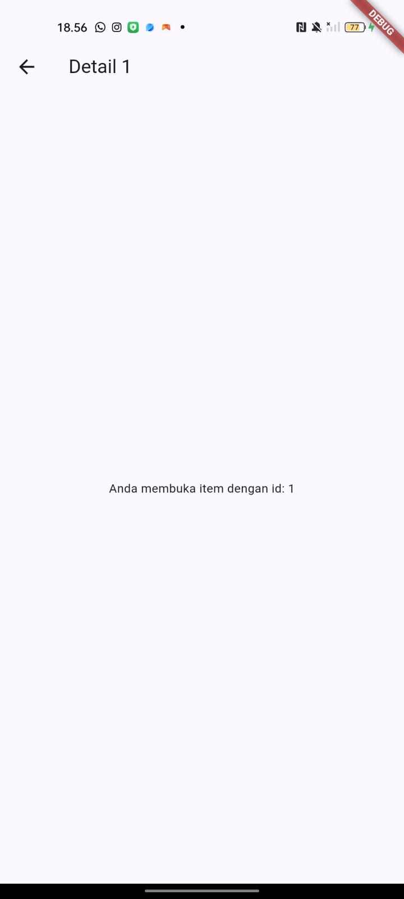

# Praktikum 2 — Aplikasi ToDo dengan Riverpod
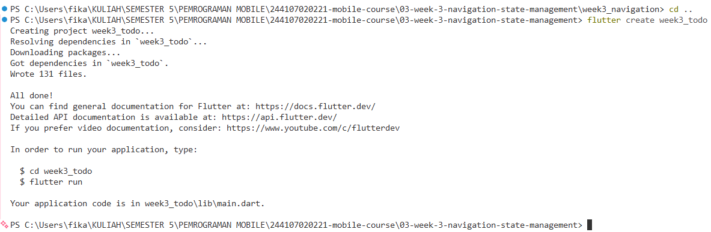
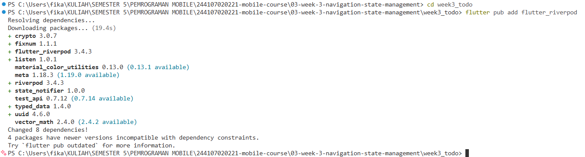

1. Bungkus aplikasi dengan ProviderScope di lib/main.dart:
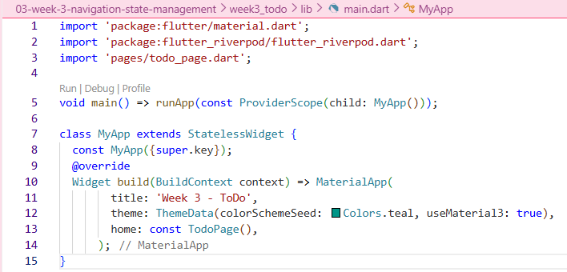

2. Buat state dan provider (lib/providers/todo_provider.dart):
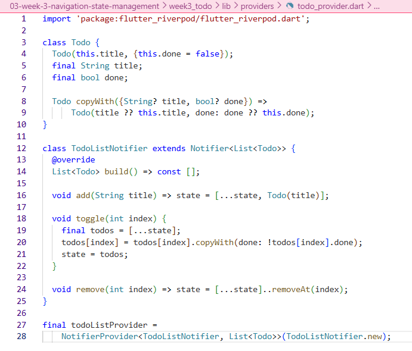

3. Tampilkan dengan ConsumerWidget (lib/pages/todo_page.dart):
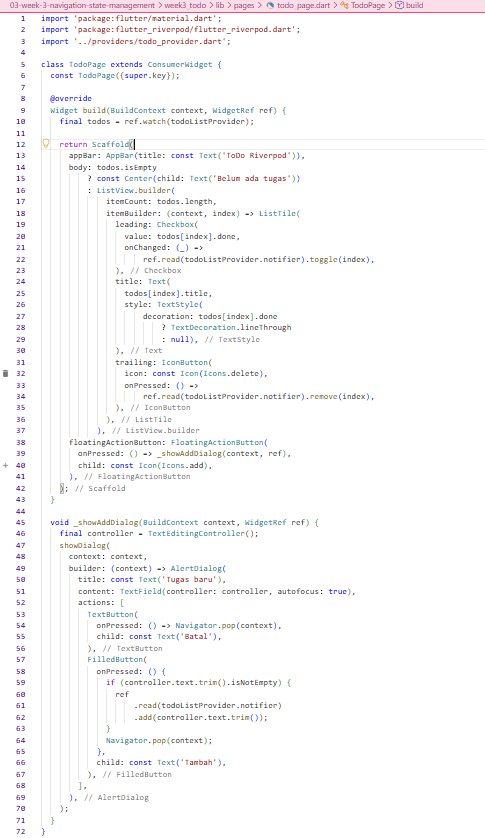

# Praktikum 3 — Uji ketiga state
1. Salin kode di atas ke project ToDo Anda (atau project terpisah) dan jalankan. Amati tampilan loading selama 2 detik pertama.

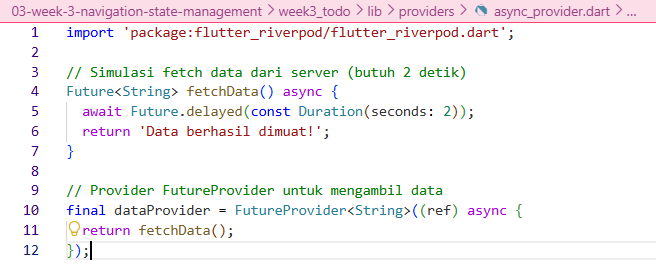
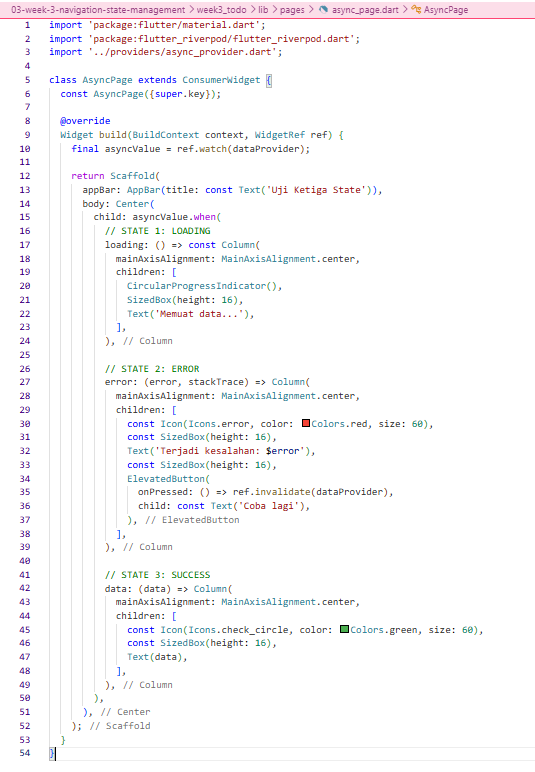
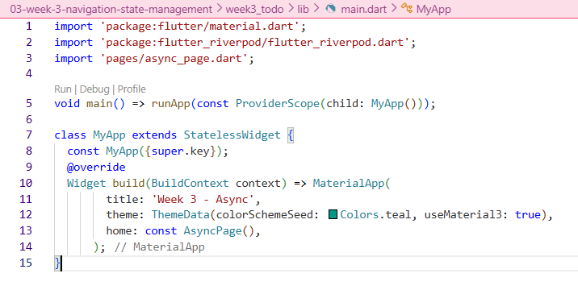
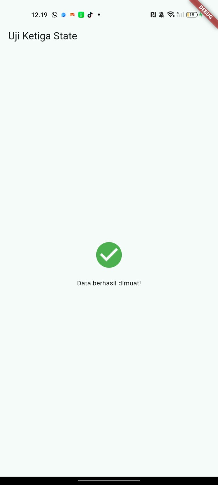

2. Ubah build() sementara untuk melempar error: throw Exception('Gagal terhubung ke server');. Jalankan dan amati UI error beserta tombol Coba lagi.
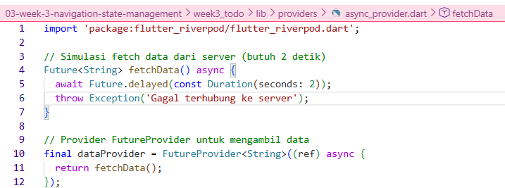
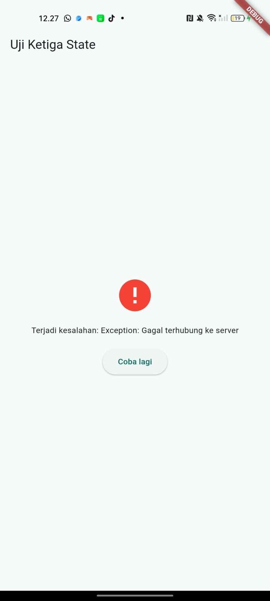

3. Tekan tombol Coba lagi, ref.invalidate membuat provider dijalankan ulang. Pulihkan kode, pastikan state success tampil.
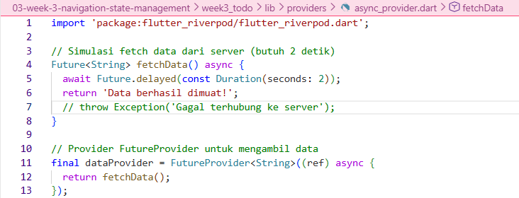
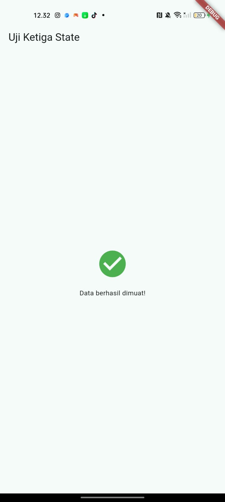

4. Refleksikan: mengapa menampilkan ulang data lama (stale data) dengan indikator refresh kadang lebih baik daripada mengosongkan layar? Kapan pola itu penting?
- Menurut saya, menampilkan data lama sambil tetap memberi indikator refresh itu lebih baik daripada mengosongkan layar sepenuhnya. Pertama, pengguna jadi tidak bingung karena layar tidak kosong—mereka masih bisa melihat informasi yang sudah ada sambil menunggu data baru dimuat. Kedua, aplikasi terasa lebih cepat dan responsif karena pengguna tidak melihat layar putih atau loading besar yang bikin kesan lambat. Ketiga, pengguna tidak kehilangan konteks; misalnya saat scroll di feed, data lama tetap terlihat sementara data baru diambil di belakang. Keempat, kalau pengambilan data baru gagal, data lama masih bisa diakses, jadi pengguna tidak kehilangan informasi. Terakhir, pengalaman pengguna jadi lebih mulus karena transisi dari data lama ke data baru tidak menimbulkan "flash" layar kosong.

## AI Challenge
# AI Prompt Challenge
Minta AI coding assistant (Cursor, Copilot, Claude Code, atau tool setara) : 

Buatkan halaman Flutter bernama StatsPage menggunakan flutter_riverpod.
Requirements:
- ConsumerWidget dengan satu AsyncNotifierProvider yang mensimulasikan
  pengambilan data statistik (delay 2 detik, kadang gagal 30%).
- UI harus menangani loading (spinner), error (pesan + tombol retry),
  dan success (ListView 3 item).
- Berikan unit test untuk notifier-nya.
Jelaskan setiap bagian kode dalam komentar.

# AI Verification Checklist
Apakah state diubah secara immutable (tidak ada state.add() atau mutasi list langsung)?
- Iya, state diubah secara immutable. Di dalam method refresh(), saya menggunakan state = const AsyncLoading() dan state = await AsyncValue.guard(_fetchStats). Tidak ada pemanggilan state.add() atau mutasi list secara langsung, sehingga Riverpod dapat mendeteksi perubahan dan UI ter-rebuild dengan benar.

Apakah ref.watch hanya dipakai di dalam build, dan ref.read di callback?
- Iya, ref.watch hanya dipakai di dalam method build() untuk memantau perubahan state (ref.watch(statsProvider)). Sementara itu, ref.read dipakai di dalam callback tombol retry (ref.read(statsProvider.notifier).refresh()), sehingga tidak terjadi rebuild yang tidak perlu.

Apakah ketiga state AsyncValue benar-benar ditangani (bukan hanya success)?
- Iya, ketiga state ditangani dengan lengkap menggunakan AsyncValue.when(): state loading menampilkan CircularProgressIndicator, state error menampilkan pesan error beserta tombol "Coba lagi", dan state data menampilkan ListView berisi 3 item statistik.

Apakah provider dideklarasikan dengan tipe eksplisit dan tidak duplikat dengan provider lain?
- AsyncNotifierProvider<StatsNotifier, List<StatItem>>. Provider ini juga tidak duplikat dengan provider lain karena hanya ada satu statsProvider di dalam project.

Apakah kode AI memakai API Riverpod versi lama (StateProvider antipattern, StateNotifierProvider usang, atau Consumer bertingkat yang tidak perlu)? Perbaiki ke pola Notifier/ConsumerWidget.
- Tidak. Kode ini sudah menggunakan API Riverpod modern, yaitu AsyncNotifier dan AsyncNotifierProvider. Tidak ada StateProvider, StateNotifierProvider, atau Consumer bertingkat yang tidak perlu.

Jalankan flutter analyze dan flutter test, apakah hasil AI lolos tanpa warning?
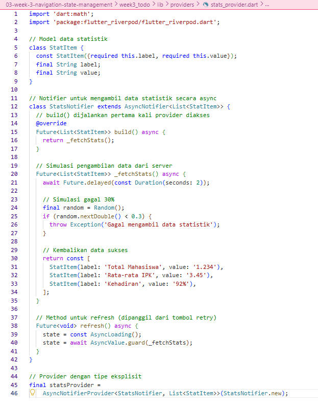
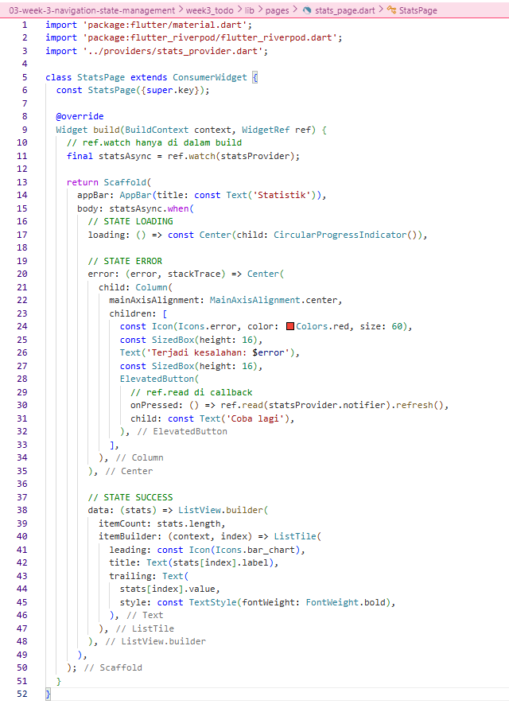
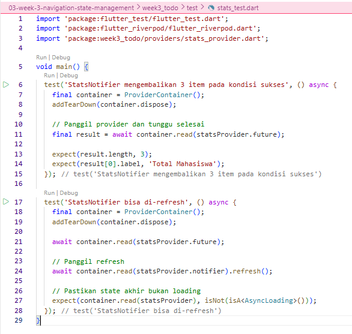
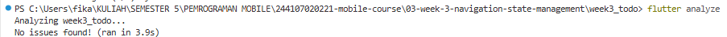
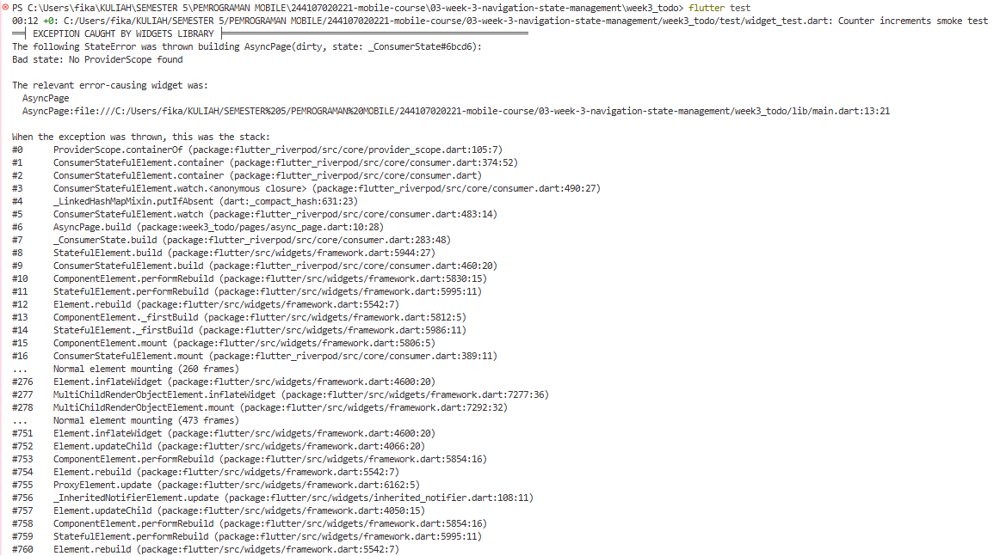
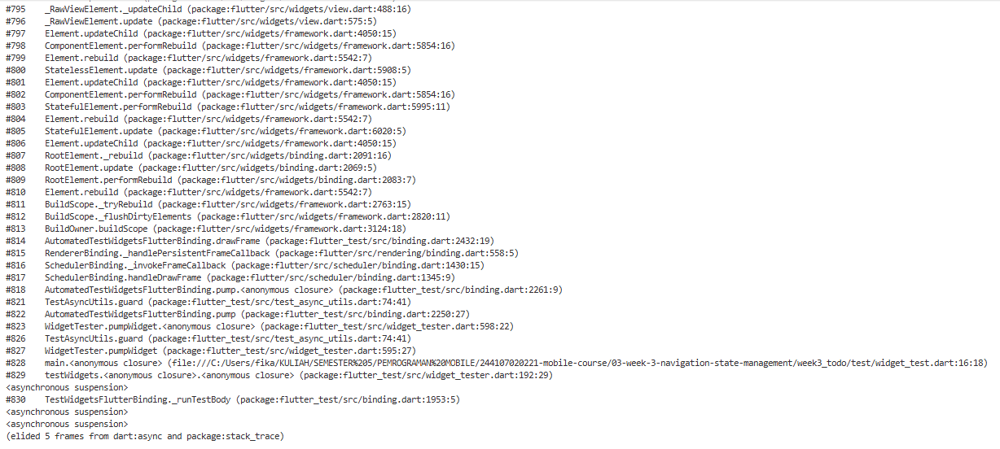
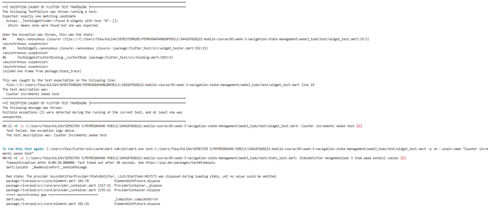
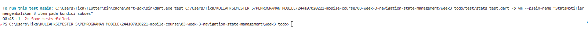