## Jobsheet 4
*Nama:* Shafiqa Nabila Maharani Khoirunnisa
*NIM:* 244107020221
*Kelas:* TI-3E

## Langkah-langkah beserta bukti Screenshoot:
### LAPORAN PRAKTIKUM WEEK04

<h3>JOBSHEET 4</h3>

<blockquote>

### Langkah Praktikum :

# Praktikum 1: Dio dan model data

Siapkan project
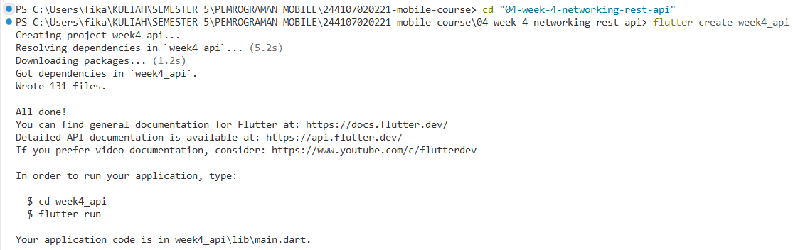
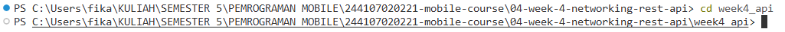
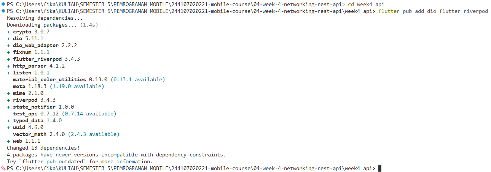

Struktur folder:
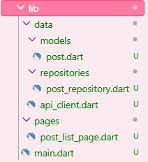

1. Model data dengan fromJson aman null
Buat lib/data/models/post.dart. API dummy yang dipakai minggu ini adalah JSONPlaceholder (gratis, tanpa API key) dengan endpoint GET /posts.
- 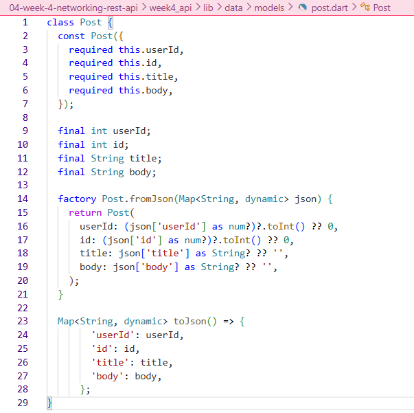

2. Konfigurasi Dio terpusat
Buat lib/data/api_client.dart. Seluruh konfigurasi jaringan (base URL, timeout, logging) hidup di satu tempat:
- 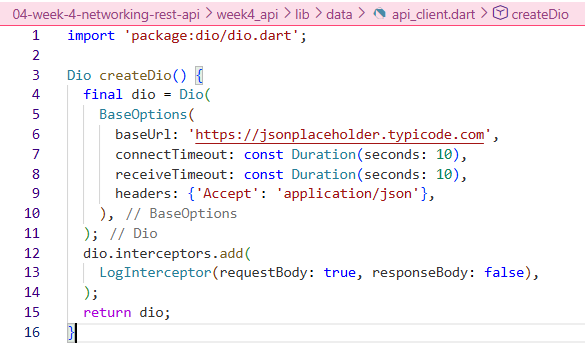

3. Repository sebagai pintu data
Buat lib/data/repositories/post_repository.dart:
- 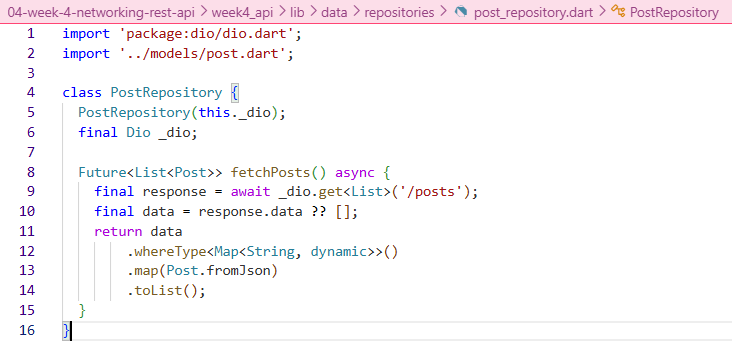

# Praktikum 2: Provider dan error handling

4. Provider AsyncNotifier + pesan error ramah pengguna
Buat lib/data/providers.dart. Provider mengubah exception teknis menjadi pesan yang bisa ditampilkan ke pengguna:
- 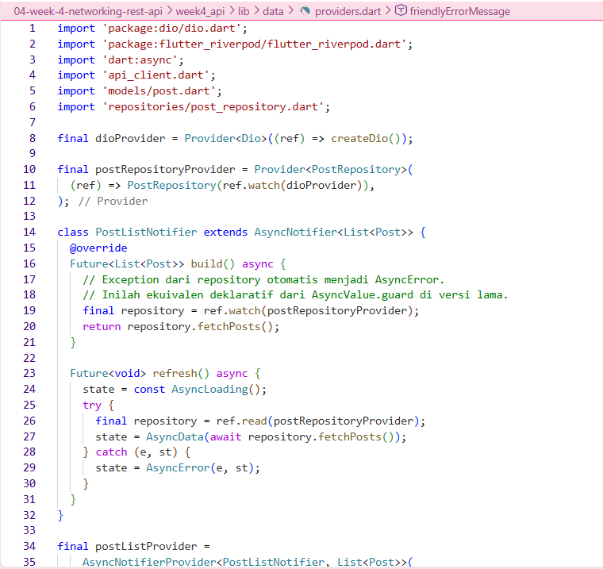

5. UI: loading, error, empty, success
Buat lib/pages/post_list_page.dart. Setiap state mendapat tampilannya sendiri:
- 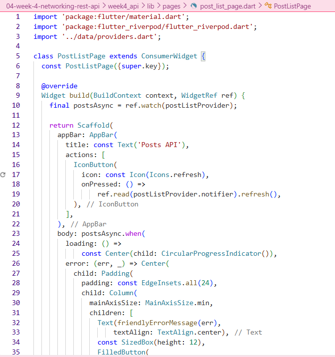

6. Entry point dengan ProviderScope
Isi lib/main.dart:
- 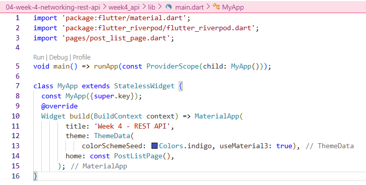

Uji tiga skenario error
1. Jalankan aplikasi dengan internet normal, amati loading lalu daftar 100 posts.
- 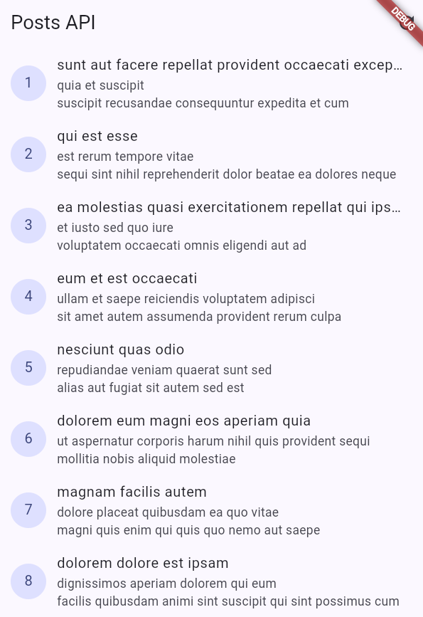
2. Matikan internet (mode pesawat), tekan refresh, amati pesan ramah + tombol Coba lagi. Nyalakan kembali internet, tekan Coba lagi.
- 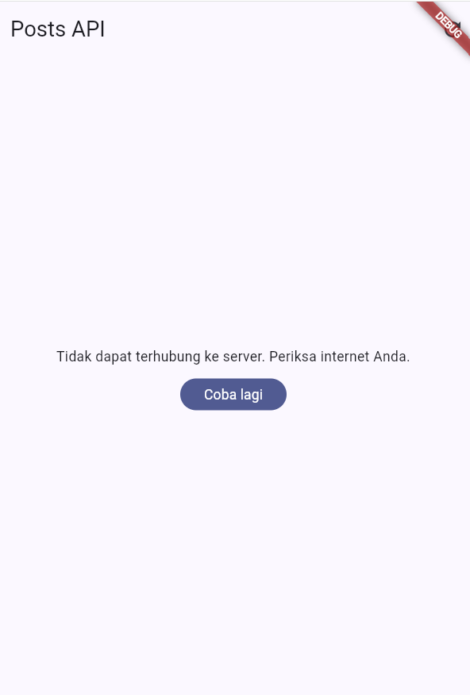
3. Sementara ubah baseUrl menjadi URL salah, amati pesan error koneksi. Kembalikan setelah uji.
- 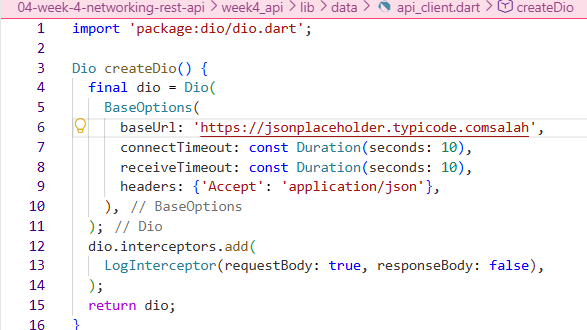
- 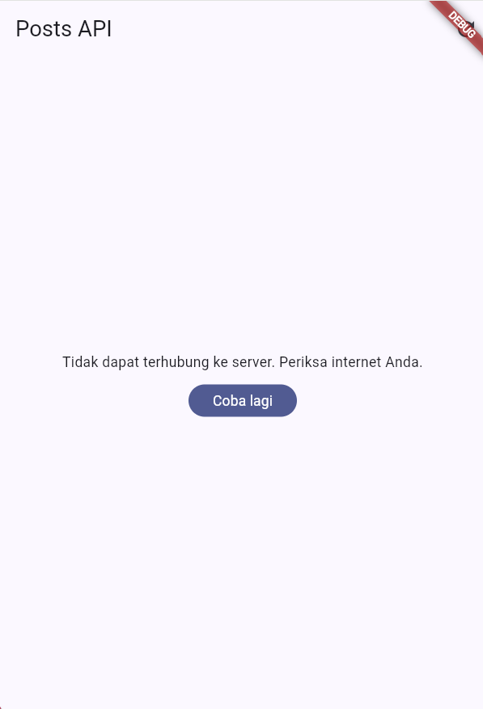

# Praktikum 3: Pagination dasar
7. Repository paginated
Tambahkan method berikut ke PostRepository:
- 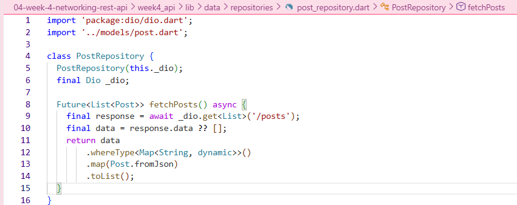

8. Notifier dengan state halaman
Lanjutkan lib/data/paged_posts.dart dengan notifier (guard ganda + data lama dipertahankan saat error):
- 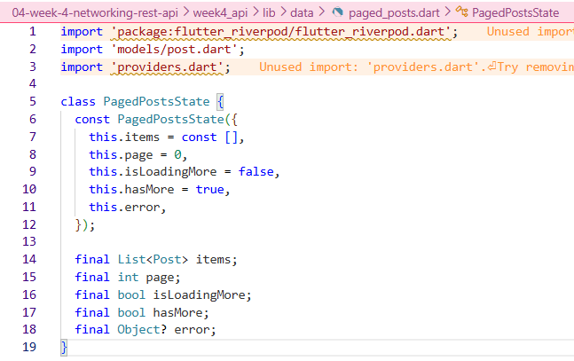

8. Notifier dengan state halaman (lanjutan)
Lanjutkan file lib/data/paged_posts.dart dengan notifier:
- 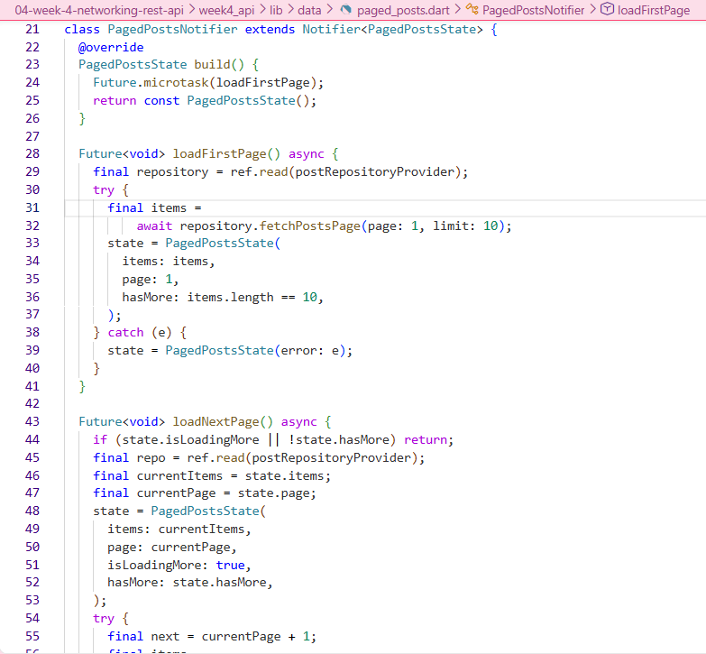

9. UI infinite scroll
Buat lib/pages/paged_post_page.dart dengan ScrollController yang memicu halaman berikut 200px sebelum ujung list:
- 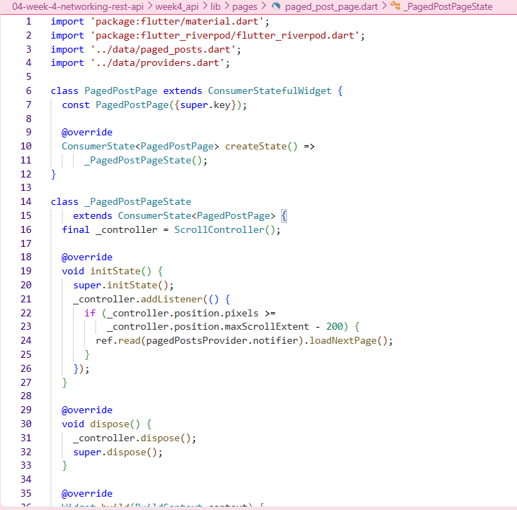

Ubah home di main.dart menjadi PagedPostPage, jalankan, dan scroll sampai bawah. Amati: halaman 1 tampil dulu, indikator muncul, data bertambah tanpa reload penuh.
- 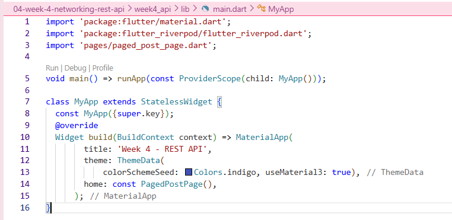
- 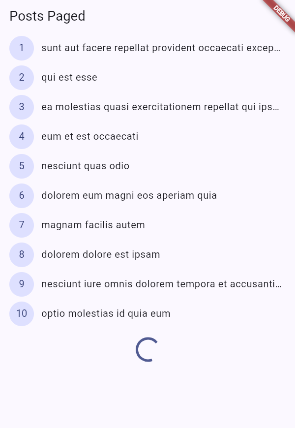

# AI Verification Checklist
Sebelum kode AI diterima, verifikasi hal berikut dan catat temuan Anda di README:

1. Apakah UI memanggil Dio secara langsung (dilarang) atau lewat repository?
- UI tidak memanggil Dio secara langsung. Semua akses ke jaringan dilakukan melalui CommentRepository, yang menerima objek Dio lewat constructor injection. Jadi, UI hanya berinteraksi dengan repository, bukan dengan Dio. Ini penting karena memisahkan logika jaringan dari tampilan, sehingga kode lebih rapi, mudah diuji, dan mudah diganti kalau nanti mau pakai HTTP client lain.

2. Apakah fromJson aman null, atau masih memakai cast langsung yang bisa crash?
- Berdasarkan hasil pemeriksaan, metode fromJson pada model Comment telah diimplementasikan secara aman terhadap nilai null. Setiap field tidak di-cast secara langsung, melainkan menggunakan pola defensif seperti (json['postId'] as num?)?.toInt() ?? 0 untuk tipe numerik, dan json['name'] as String? ?? '' untuk tipe string. Dengan pendekatan ini, apabila terdapat field yang hilang atau tipe data yang tidak sesuai, aplikasi tidak akan mengalami crash, melainkan akan menggunakan nilai default yang telah ditentukan. Hal ini penting karena respons dari API nyata sering kali tidak sesuai dengan dokumentasi, sehingga diperlukan penanganan yang robust terhadap kemungkinan tersebut.

3. Apakah semua tipe DioExceptionType (timeout, connectionError, badResponse) dipetakan ke pesan pengguna?
- Berdasarkan hasil pemeriksaan, seluruh tipe DioExceptionType telah dipetakan ke pesan yang ramah bagi pengguna. Tipe connectionTimeout, sendTimeout, dan receiveTimeout dipetakan menjadi pesan mengenai koneksi yang lambat atau timeout. Tipe connectionError dipetakan menjadi pesan bahwa aplikasi tidak dapat terhubung ke server. Sementara itu, tipe badResponse dipetakan secara spesifik berdasarkan kode status, yaitu 404 untuk data yang tidak ditemukan, serta 401 dan 403 untuk akses yang ditolak. Selain itu, terdapat pula penanganan default untuk tipe error lainnya. Dengan pemetaan ini, pengguna tidak akan melihat pesan teknis yang membingungkan, melainkan informasi yang mudah dipahami dan dapat ditindaklanjuti.

4. Apakah baseUrl/timeout terpusat di satu client, bukan tersebar di tiap method?
- Berdasarkan hasil pemeriksaan, baseUrl dan timeout telah terpusat pada satu client, yaitu di dalam fungsi createDio() yang berada di file api_client.dart. Nilai baseUrl diatur sebagai https://jsonplaceholder.typicode.com, dengan connectTimeout dan receiveTimeout masing-masing 10 detik. Repository tidak mengatur timeout atau baseUrl secara mandiri, melainkan hanya menerima objek Dio yang telah dikonfigurasi. Dengan pendekatan ini, konfigurasi jaringan menjadi konsisten di seluruh aplikasi dan hanya perlu diubah di satu tempat apabila terjadi perubahan.

5. Apakah test AI benar-benar menguji kasus field hilang, atau hanya happy path? Tambahkan minimal 1 edge case sendiri.
- Berdasarkan hasil pemeriksaan, test yang dihasilkan AI sudah menguji kasus field hilang, bukan hanya happy path. Test pertama menggunakan objek JSON kosong ({}) dan memverifikasi bahwa seluruh field jatuh ke nilai default, yaitu 0 untuk numerik dan string kosong untuk teks. Test kedua menguji tipe data yang tidak sesuai, misalnya postId dikirim sebagai string dan name bernilai null, untuk memastikan tidak terjadi crash. Selanjutnya, saya menambahkan satu edge case tambahan berupa test dengan data lengkap untuk memverifikasi bahwa proses parsing pada kondisi normal juga berjalan dengan benar. Dengan demikian, cakupan pengujian mencakup kondisi ekstrem, kondisi tidak valid, dan kondisi normal.

6. Jalankan flutter analyze dan flutter test, apakah hasil AI lolos tanpa warning?
- 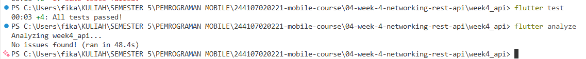

## Refactoring Challenge
1. Ekstrak widget baris post menjadi PostTile tersendiri agar ListView.builder pendek dan mudah diuji.
- 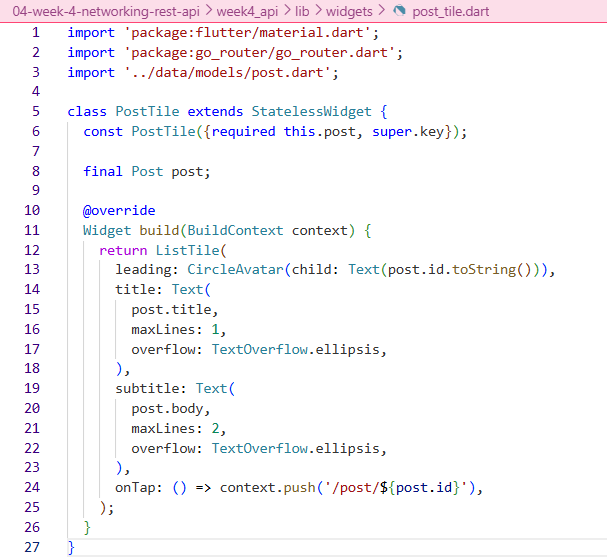
- 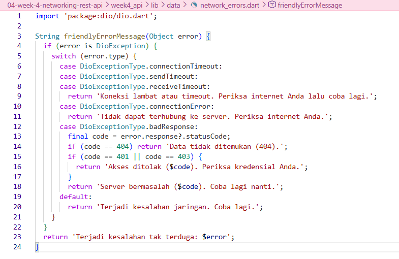
- 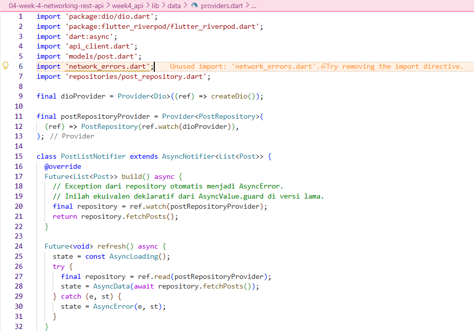

2. Pindahkan friendlyErrorMessage ke file lib/data/network_errors.dart agar bisa dipakai ulang halaman paged dan non-paged.
- 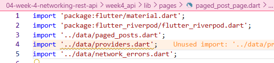
- 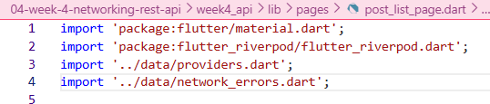

3. Tambahkan halaman detail post dengan GoRouter (/post/:id) yang menampilkan title dan body lengkap, state detail diambil dari list yang sudah dimuat atau via repository bila langsung dibuka.
- 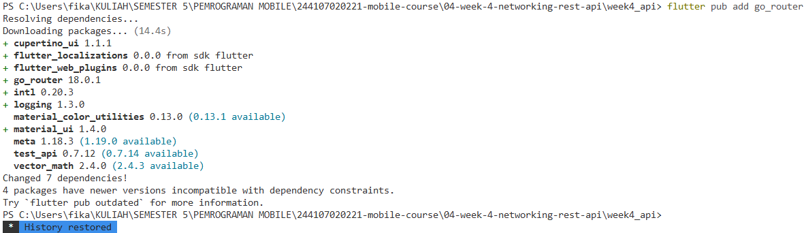
- 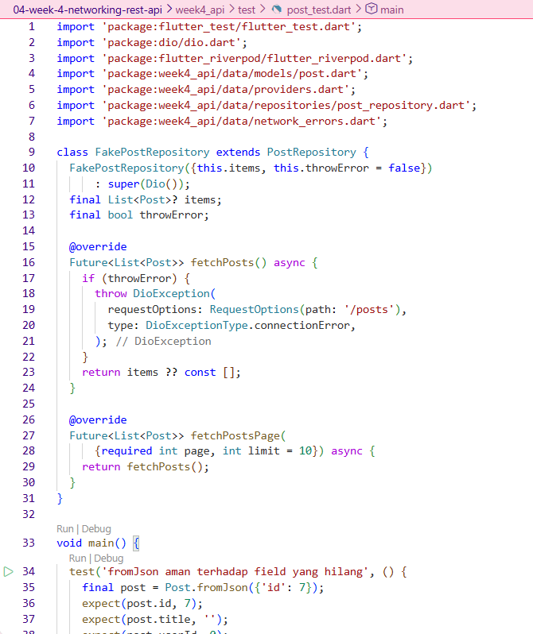

# Testing: unit test model + mock repository
- 
