## Jobsheet 5
*Nama:* Shafiqa Nabila Maharani Khoirunnisa
*NIM:* 244107020221
*Kelas:* TI-3E

## Langkah-langkah beserta bukti Screenshoot:
### LAPORAN PRAKTIKUM WEEK05

<h3>JOBSHEET 5</h3>

<blockquote>

### Langkah Praktikum :

# Praktikum 1: SharedPreferences

Siapkan project
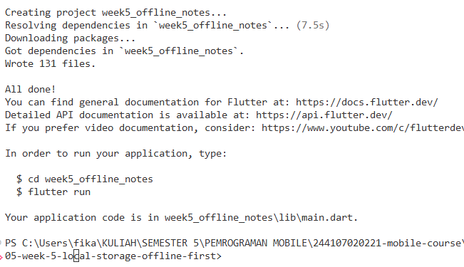

Struktur folder:
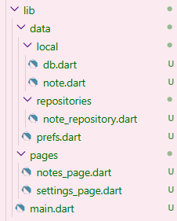

1. Repository preferensi
Buat lib/data/prefs.dart. Seluruh akses key-value terpusat di sini, bukan tersebar di widget:
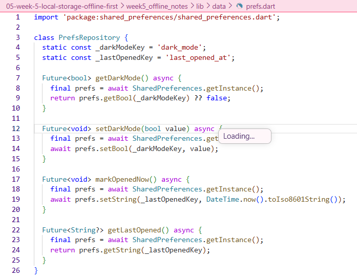
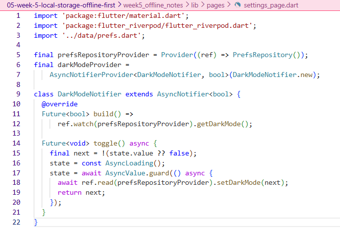

# Praktikum 2: SQLite dan repository catatan
1. Model catatan
Buat lib/data/local/note.dart. Field dirty menandai catatan yang belum tersinkron:
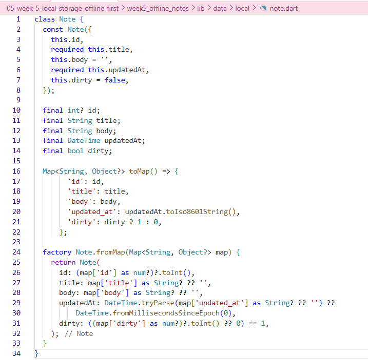

2. Pembuka database
Buat lib/data/local/db.dart. Satu fungsi pembuka dipakai seluruh repository:
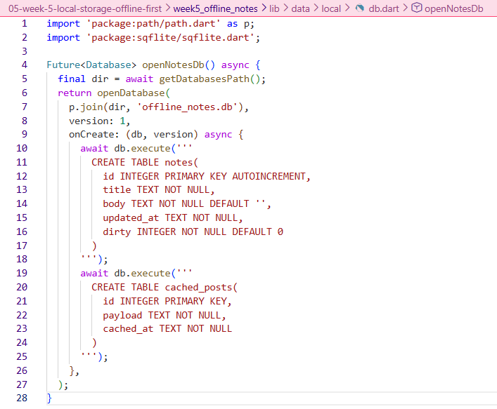

3. Repository sebagai satu-satunya pintu data
Buat lib/data/repositories/note_repository.dart:
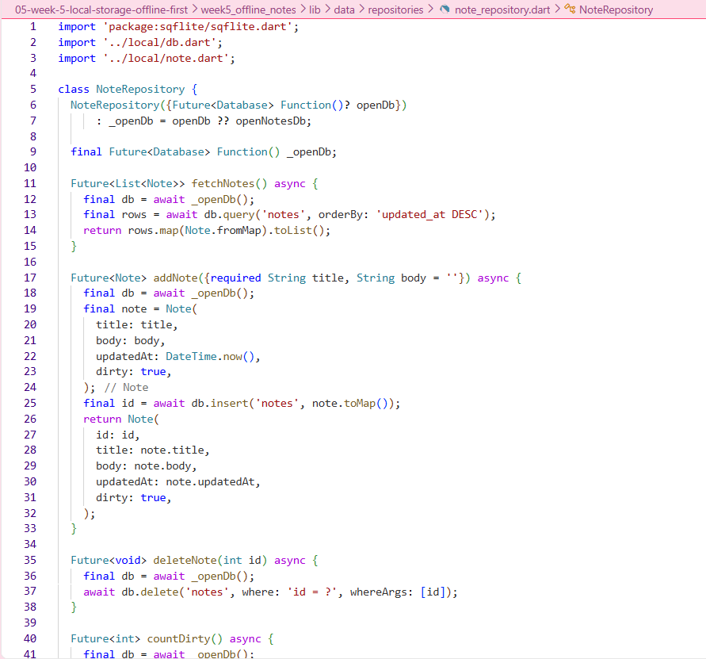

# Praktikum 3: Cache-first dan antrean sync
1. Cache-first read untuk data API
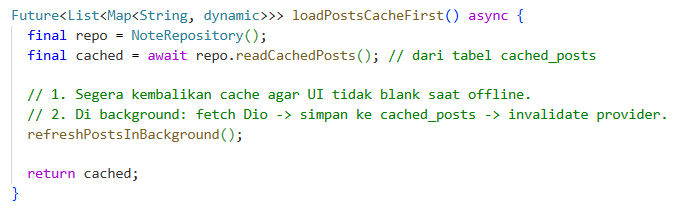

2. Sinkronisasi catatan kotor (dirty)
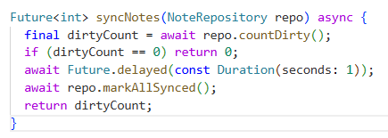

## AI Challenge

AI Verification Checklist

1. Apakah AI menempatkan daftar catatan di SharedPreferences? (menolak: rapuh untuk koleksi).
- Tidak. AI merekomendasikan SharedPreferences hanya untuk preferensi (tema, last opened). Untuk daftar catatan, AI memilih SQLite (sqflite) karena SharedPreferences dianggap rapuh untuk koleksi besar — tidak mendukung query, sorting, filtering, atau relasi. Kalau dipaksa, data catatan akan disimpan sebagai string panjang yang susah di-parse dan rawan korup.

2. Apakah skema AI mendukung antrean sync (dirty flag / updated_at) atau hanya CRUD polos?
- Skema AI mendukung antrean sync. Tabel notes memiliki:
Field dirty (integer 0/1) — menandai catatan yang belum disinkron ke server.
Field updated_at (text ISO8601) — mendukung aturan konflik last-write-wins.
Selain itu, ada index pada dirty (mempercepat countDirty()) dan index pada updated_at (mempercepat sorting). Jadi bukan CRUD polos — sudah dirancang untuk sinkronisasi.

3. Apakah klaim "real-time" AI didukung stream (Drift/watch) atau hanya asumsi?
- Klaim real-time hanya ada pada Drift, yang memang punya method watch() untuk stream otomatis. Untuk sqflite, tidak ada stream — AI tidak mengklaim sqflite real-time. Di project saya, UI di-refresh manual setiap kali ada perubahan, yaitu dengan memanggil _loadNotes() setelah addNote() atau deleteNote(). Jadi tidak ada asumsi real-time yang tidak didukung.

4. Apakah estimasi boilerplate AI masuk akal setelah Anda mencoba instalasinya (flutter pub add + migrasi skema)?
- Iya, masuk akal. Setelah mencoba:

SharedPreferences: 1 file prefs.dart, ~20 baris. Sangat ringan, tidak butuh setup.
sqflite: 2 file (db.dart + note_repository.dart), total ~100 baris. Butuh migrasi skema manual (onCreate), tapi masih wajar.
Drift: butuh build_runner, generated code, dan setup lebih rumit. Boilerplate paling besar.
Hive: butuh type adapter, generated code (build_runner), tapi lebih ringan dari Drift.

Estimasi AI sesuai dengan kenyataan di lapangan.

5. Keputusan final Anda beserta alasannya, boleh berbeda dari rekomendasi AI selama berargumen.
- Saya memilih SharedPreferences + sqflite, sama seperti rekomendasi AI. Alasan:

SharedPreferences cukup untuk preferensi tema (1 key-value, simpel, ringan).
sqflite cocok untuk 1000+ catatan karena butuh query kompleks (sorting by updated_at, filter dirty), dan mendukung dirty flag + updated_at untuk sync.
Saya tidak memilih Drift karena boilerplate-nya terlalu besar untuk kebutuhan project ini. Saya juga tidak butuh stream real-time (refresh manual sudah cukup).
Saya tidak memilih Hive karena query-nya terbatas (tidak ada SQL), padahal saya butuh sorting dan filter berdasarkan dirty.
Kombinasi ini memberi keseimbangan terbaik antara ringan, fleksibel, dan mudah di-test.

## Refactoring, testing, dan error umum
# Refactoring Challenge
Lakukan refactoring berikut pada project catatan Anda, lalu commit dengan pesan yang jelas:

1. Ekstrak baris catatan menjadi widget NoteTile tersendiri yang menampilkan badge "belum tersinkron" bila dirty == true.
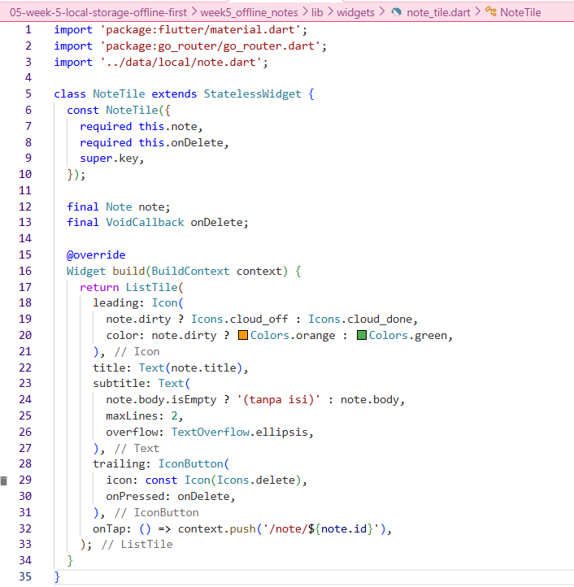

2. Pindahkan logika cache posts dan syncNotes ke file lib/data/sync.dart agar repository tetap fokus pada CRUD.
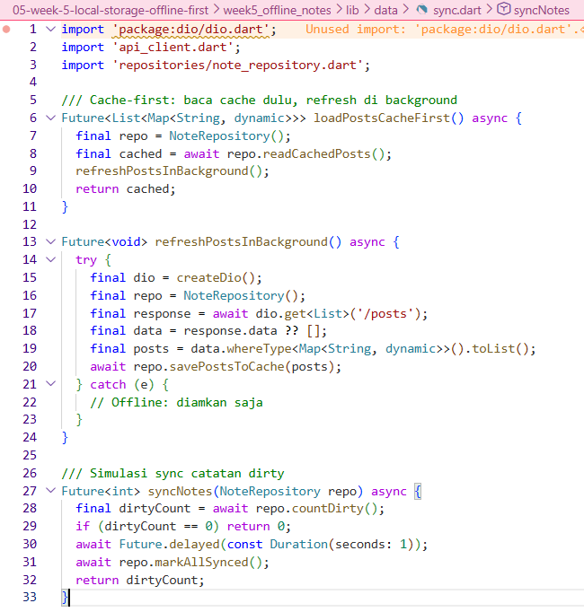

3. Tambahkan halaman detail catatan dengan GoRouter (/note/:id) yang membaca dari repository lokal, bukan dari state halaman list.
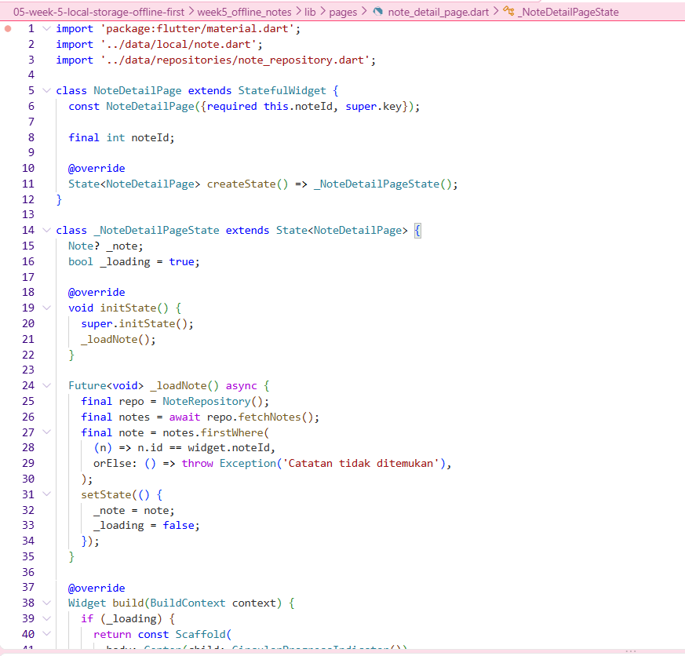

# Testing: unit test model + repository palsu
Buat test/note_test.dart. Uji mapping aman null dan provider dengan repository palsu (tanpa SQLite sungguhan):
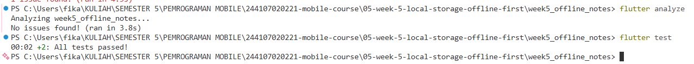

## Tugas, refleksi, dan referensi
# Mini project / Industry Challenge
Bangun aplikasi Offline Notes sebagai tugas minggu ini (kembangkan project codelab atau buat baru):

1. Preferensi: toggle tema gelap/terang + waktu terakhir dibuka via SharedPreferences.
- Karena SharedPreferences cuma cocok untuk data key-value sederhana, bukan untuk koleksi. Kalau dipaksa, performanya lambat (harus parse JSON manual setiap query), tidak bisa sorting/filter native, dan rawan korup kalau app crash saat menulis. Jadi, untuk koleksi seperti catatan, pakai SQLite.

2. CRUD catatan persisten via SQLite (sqflite) melalui repository lokal + Riverpod; daftar diurutkan updated_at terbaru.
- Cache-first cukup untuk data yang jarang berubah dan lebih mengutamakan kecepatan, seperti daftar artikel atau post. Tapi untuk data yang harus selalu terbaru, seperti harga saham atau kurs, kita butuh network-first. Intinya, pilihan strategi tergantung seberapa sering data berubah.

3. Offline-first: cache-first untuk data bacaan, dirty flag + syncNotes untuk tulisan, dan aturan konflik eksplisit yang didokumentasikan.
- Dirty flag menandai catatan yang belum disinkron (dirty = 1). Setiap kali ada perubahan, data disimpan dulu ke SQLite, jadi UI tetap responsif. Di background, syncNotes() mengirim catatan dirty ke server, lalu menandainya bersih (dirty = 0). Tabel outbox baru diperlukan kalau operasinya banyak (create, update, delete) dan butuh riwayat atau retry otomatis.

4. Buktikan mode pesawat: screenshot daftar catatan saat offline dan badge dirty sebelum/sesudah sync.
- Saya menolak saran Drift karena boilerplate-nya terlalu besar untuk project kecil, dan saya tidak butuh stream real-time. Saya juga menolak Hive karena query-nya terbatas. Keputusan saya tetap SharedPreferences untuk preferensi dan sqflite untuk catatan.

5. Sertakan minimal 2 test yang lulus (1 unit test model + 1 test provider dengan repository palsu).
- 
6. Kerjakan bagian AI Challenge dan dokumentasikan prompt, tabel perbandingan storage, keputusan final, serta alasan teknis Anda di docs/.
7. Push ke repository portfolio pada folder 05-week-5-local-storage-offline-first/ dengan struktur lib/, test/, docs/, README.md, dan screenshots/. README menjelaskan 
tujuan, fitur utama, stack teknologi, cara menjalankan, dan hasil yang dicapai.
- 